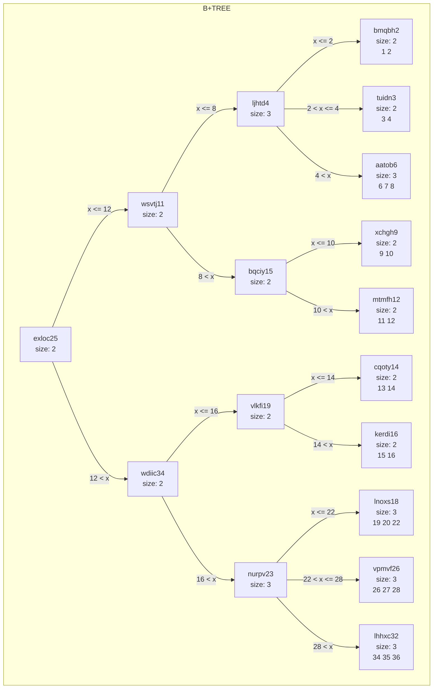
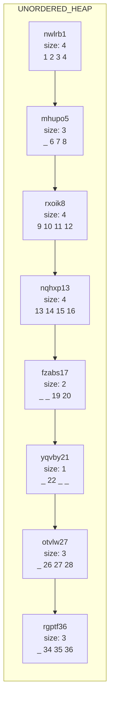

```mermaid
graph TD
subgraph B+TREE
exloc25[exloc25<br/>size: 2<br/>]
wsvtj11[wsvtj11<br/>size: 2<br/>]
ljhtd4[ljhtd4<br/>size: 3<br/>]
bmqbh2[bmqbh2<br/>size: 2<br/>1 2 ]
ljhtd4-->|x <= 2|bmqbh2
tuidn3[tuidn3<br/>size: 2<br/>3 4 ]
ljhtd4-->|2 < x <= 4|tuidn3
aatob6[aatob6<br/>size: 3<br/>6 7 8 ]
ljhtd4-->|4 < x|aatob6
wsvtj11-->|x <= 8|ljhtd4
bqciy15[bqciy15<br/>size: 2<br/>]
xchgh9[xchgh9<br/>size: 2<br/>9 10 ]
bqciy15-->|x <= 10|xchgh9
mtmfh12[mtmfh12<br/>size: 2<br/>11 12 ]
bqciy15-->|10 < x|mtmfh12
wsvtj11-->|8 < x|bqciy15
exloc25-->|x <= 12|wsvtj11
wdiic34[wdiic34<br/>size: 2<br/>]
vlkfi19[vlkfi19<br/>size: 2<br/>]
cqoty14[cqoty14<br/>size: 2<br/>13 14 ]
vlkfi19-->|x <= 14|cqoty14
kerdi16[kerdi16<br/>size: 2<br/>15 16 ]
vlkfi19-->|14 < x|kerdi16
wdiic34-->|x <= 16|vlkfi19
nurpv23[nurpv23<br/>size: 3<br/>]
lnoxs18[lnoxs18<br/>size: 3<br/>19 20 22 ]
nurpv23-->|x <= 22|lnoxs18
vpmvf26[vpmvf26<br/>size: 3<br/>26 27 28 ]
nurpv23-->|22 < x <= 28|vpmvf26
lhhxc32[lhhxc32<br/>size: 3<br/>34 35 36 ]
nurpv23-->|28 < x|lhhxc32
wdiic34-->|16 < x|nurpv23
exloc25-->|12 < x|wdiic34
end
```

```mermaid
graph LR
subgraph UNORDERED_HEAP
nwlrb1[nwlrb1<br/>size: 4<br/>1 2 3 4 ]
mhupo5[mhupo5<br/>size: 3<br/>_ 6 7 8 ]
nwlrb1-->mhupo5
rxoik8[rxoik8<br/>size: 4<br/>9 10 11 12 ]
mhupo5-->rxoik8
nqhxp13[nqhxp13<br/>size: 4<br/>13 14 15 16 ]
rxoik8-->nqhxp13
fzabs17[fzabs17<br/>size: 2<br/>_ _ 19 20 ]
nqhxp13-->fzabs17
yqvby21[yqvby21<br/>size: 1<br/>_ 22 _ _ ]
fzabs17-->yqvby21
otvlw27[otvlw27<br/>size: 3<br/>_ 26 27 28 ]
yqvby21-->otvlw27
rgptf36[rgptf36<br/>size: 3<br/>_ 34 35 36 ]
otvlw27-->rgptf36
end
```
